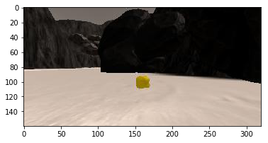
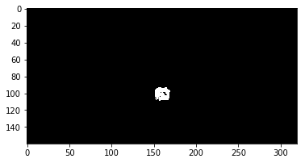

# Rover Project Writeup

## Notebook Analysis
### 1. Run the functions provided in the notebook on test images (first with the test data provided, next on data you have recorded). Add/modify functions to allow for color selection of obstacles and rock samples.
Ran the notebook with test data, I used the default color threshold of `> rgb(160, 160, 160)` for navigable area, which worked well in tests. Obstacles are calculated by taking the opposite of the navigable area and applying the mask of the warped image to only include negated parts in the field of view. 

For fined rocks i implemented color_thresh_rock woth levels=110, 110,50 
``` python
 (img[:,:,0] > rgb_thresh[0])&(rgb_thresh[0]+100 >img[:,:,0])\
                & (img[:,:,1] > rgb_thresh[1])&(rgb_thresh[1]+80 >img[:,:,1])\
                & (img[:,:,2] > rgb_thresh[2])&(rgb_thresh[2]+95 >img[:,:,2])
```                


 



### 1. Populate the `process_image()` function with the appropriate analysis steps to map pixels identifying navigable terrain, obstacles and rock samples into a worldmap.  Run `process_image()` on your test data using the `moviepy` functions provided to create video output of your result.
In `process_image()` we use the output from wraped and colour thresholded for navigable terrain, obstacles, and rocks are to convert the filtered image to rover coordinates and convert those coordinates to world coordinates based on the robot's pose. Then to find the forword direction of motion of rover we will find the resultant vector for all the navigable terrain pixels, then use these coordinates to update the world map ,  the color values for each type of coordinate by one where obstacles are red, rocks are white and navigable terrain is blue.


## Autonomous Navigation and Mapping

### 1. Fill in the `perception_step()` (at the bottom of the `perception.py` script) and `decision_step()` (in `decision.py`) functions in the autonomous mapping scripts and an explanation is provided in the writeup of how and why these functions were modified as they were.
All th code from `perception_image()` is put into `process_step()` with all the required changes

The `perception_step()` includes maping of the wraped images to the vision_image of rover.And world map is also updated and if rock exists in the vision of the rover it takes the centre of the rock and updates the world map with a white pixel.

In `decision_step()`, this is the basic implemantation of decision_step()

### 2. Launching in autonomous mode your rover can navigate and map autonomously.  Explain your results and how you might improve them in your writeup.  

**Note: running the simulator with different choices of resolution and graphics quality may produce different results, particularly on different machines!  Make a note of your simulator settings (resolution and graphics quality set on launch) and frames per second (FPS output to terminal by `drive_rover.py`) in your writeup when you submit the project so your reviewer can reproduce your results.**

I ran the simulator at a resolution of 640x480  graphics quality.


From the above image i mapped more than 40% of the worldmap with a fidelity more than 60%

Improvisations:
> If the rover is stuck , yet its going forward so by knowing the change in coordinates in forward mode we identify if its stuck in a corner and rotate in different direction

>Speed can be improvised on how much open terrain is visible in front of it.

>We can identify the rock , and find the distance and angle form the current position and
pick up the rocks


Simulation results can be seen in the `rover_autonomous.mp4` file.